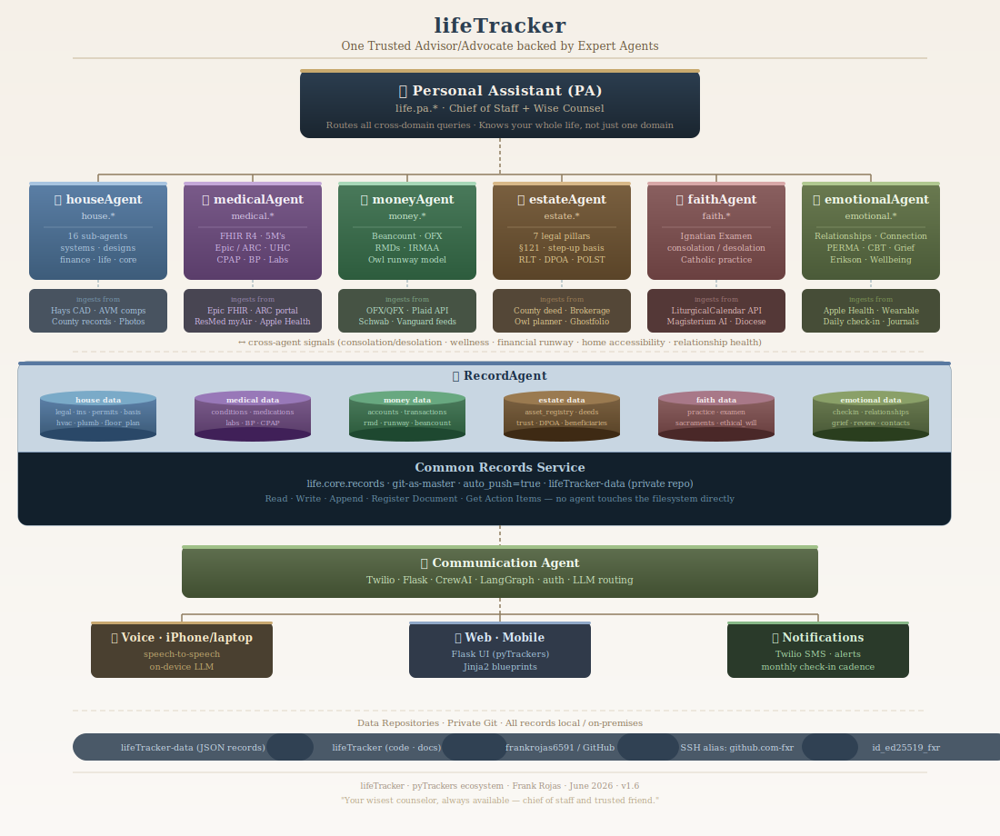

# lifeTracker — Vision & Design

**Version:** 1.0
**Author:** Frank Rojas
**Date:** June 2026

---

## 1. What lifeTracker Is

**lifeTracker** is the repository for a personal life management ecosystem — a **Personal Assistant (PA)** orchestrator backed by six discipline agents, each an expert in one domain of life. One voice call. One web app. One shared communication layer.

**Design principle: One tracker, six discipline agents.**

```
lifeTracker/
├── docs/                ← this document, architecture diagrams
├── houseAgent/          ← home manager — systems, maintenance, aging-in-place
├── medicalAgent/        ← health advocate — history, medications, care navigation
├── moneyAgent/          ← financial advisor — accounts, retirement, RMDs
├── estateAgent/         ← estate manager — assets, trusts, succession
├── emotionalAgent/      ← counselor — relationships, human connection, emotional health
├── faithAgent/          ← spiritual advisor — Catholic practice, Examen, community
└── recordAgent/         ← common records service — all agents write through it
```

**Not included here:** `llcRentalTracker` — the LLC/rental business manager is a **separate repo on the work account** (`wbgroupmgr`). It integrates via narrow API signal only and is never touched by this codebase.

---

## 2. Why a Personal Assistant at 70

Most people manage their health, finances, home, business, estate, relationships, and faith in silos. A doctor doesn't know the house is a financial drain. The financial planner doesn't know health is declining. The home manager doesn't know the estate plan is outdated. Nobody is watching the quality of your most important relationships — whether loneliness is creeping in, whether the bonds that matter are being tended.

The cost of these silos compounds with age: missed connections become missed decisions; missed decisions become crises.

The Personal Assistant fixes this by sitting above every life domain, knowing the full picture, and surfacing what actually matters — without being asked.

> The goal is not to replace your advisors. It is to be the one person in the room who knows what every advisor is saying — and who synthesizes it into a clear picture of where you stand and what to do next.
>
> *A mix of a CEO's chief of staff and a wise grandma counseling a grandchild: clear-eyed about priorities, warm in delivery, unhurried in wisdom.*

Life in the 70s creates a specific management challenge:

- Systems age. Health changes. Estate decisions become urgent.
- Emotional resilience is tested by loss, transition, and the thinning of social circles.
- The cognitive and logistical load of managing a full life does not decrease — it increases.

The PA is built for this stage:
- You are never surprised by a life event that should have been anticipated.
- You are never managing two unrelated crises when they are actually the same problem viewed from two disciplines.
- You are never wondering what matters most right now.
- No domain — including the quality of your closest relationships — goes dark.

---

## 3. System Architecture



---

### 3.1 Architecture in Text

```
╔══════════════════════════════════════════════════════════════════════════╗
║  COMMUNICATION CHANNELS (shared across all agents)                       ║
║  (A) iPhone Voice     (B) PA Web UI        (C) Local Mac UI             ║
║  Call Twilio number   Browser → PA URL     Browser → :5000              ║
╚══════════════════════════════════════════════════════════════════════════╝
                    │ Twilio webhook  │ HTTPS  │ HTTP
                    ▼                 ▼        ▼
╔══════════════════════════════════════════════════════════════════════════╗
║  pytracker.core  (shared Python package)                                 ║
║  Auth · IntentParser (Haiku) · ResponseSynthesizer (Sonnet)              ║
║  VoiceResponder · SessionManager · ActionItemQueue                       ║
╚══════════════════════════════════════════════════════════════════════════╝
                                   │
                    ┌──────────────▼──────────────┐
                    │  Personal Assistant (PA)      │
                    │  life.pa.*                   │
                    │  Routes · Synthesizes         │
                    │  Monthly life review          │
                    └──┬──┬──┬──┬──┬──┬───────────┘
                       │  │  │  │  │  │
           ┌───────────┘  │  │  │  │  └──────────────┐
           │    ┌─────────┘  │  │  └──────────┐      │
           │    │    ┌───────┘  └──────┐       │      │
           ▼    ▼    ▼                 ▼       ▼      ▼
        ┌──────────────────────────────────────────────────────┐
        │ house  │ medical │  money │ estate │emotional│ faith │
        │Agent   │Agent    │Agent   │Agent   │Agent    │Agent  │
        │house.* │medical.*│money.* │estate.*│emotion.*│faith.*│
        └────┬───┴────┬────┴────┬───┴────┬───┴────┬───┴───┬───┘
             │        │         │  each agent builds its own  │
        [Hays│CAD] [Epic│FHIR] [OFX│Plaid][Deed│Brok.][Litur│gical][Apple│Health]
             │        │         │  ingestion services         │
             └────────┴─────────┴─────────┴────────┴──────────┘
                                      │
                    ╔═════════════════▼═══════════════════╗
                    ║  RecordAgent (common records service) ║
                    ║  life.core.records                    ║
                    ║  lifeTracker-data (private Git repo)  ║
                    ║  records/**/*.json  auto_push=true    ║
                    ╚══════════════════════════════════════╝
```

### 3.2 Cross-Agent Dependencies

```
PersonalAssistant ◄── ALL agents (monthly briefings, action items, alerts)

estateAgent ◄── houseAgent (home value, equity, deferred maintenance cost)
            ◄── moneyAgent (account balances, retirement projections)
            ◄── llcRentalTracker (business income, depreciation, K-1)
            ◄── medicalAgent (longevity projection, care cost modeling)

moneyAgent  ◄── houseAgent (HELOC, home projects budget)
            ◄── llcRentalTracker (rental income, business distributions)
            ◄── medicalAgent (health insurance, HSA, out-of-pocket)

medicalAgent ◄── emotionalAgent (mental/relational health ↔ physical health)
             ◄── houseAgent.accessibility (health needs → home mods)
             ◄── moneyAgent (HSA balance, insurance coverage)

emotionalAgent ◄── ALL agents (stress events, relationship impacts from any domain)
               ◄── faithAgent (consolation/desolation ↔ emotional + relational wellbeing)
               ◄── medicalAgent (health events affecting mood, cognition, social energy)

faithAgent   ◄── emotionalAgent (grief, transition states, isolation flags)
             ◄── PA (major life events triggering spiritual response)

houseAgent.life.accessibility ◄── medicalAgent (mobility needs → home adaptations)
moneyAgent.planning ◄── houseAgent.finance (liquidity check before project approval)
```

---

## 4. Personal Assistant (PA)

**Role:** Chief of staff. Routes. Synthesizes. Prioritizes. Advocates for simplicity.

The PA knows the full priority stack across all agents. What is overdue. What is in conflict between domains. What the owner most values right now. It is the one entity in the system that knows how a health event, a financial decision, a relationship strain, and a house crisis are all connected.

### Key Scenarios

- *Monthly life review:* Pull briefings from all active agents → produce a unified view of where things stand, what needs attention, and what is on track.
- *Cross-domain question:* "Can I afford to replace the HVAC this year?" → coordinate moneyAgent (liquidity), houseAgent (HVAC cost and urgency), estateAgent (retirement runway impact).
- *Priority arbitration:* When four agents surface urgent items simultaneously, the PA makes the call — it knows which crisis is actually three crises wearing one coat.
- *Burden reduction:* Identify items that can be deferred, eliminated, or automated. The system's job is to reduce cognitive load, not add to it.

### How You Talk to It

```
"How are my finances and can I afford a new roof?"

IntentParser (Haiku):
  → agents: ["money", "house"]
  → question: "current financial position and roof replacement cost"

PA routes → moneyAgent + houseAgent.systems.roofing

ResponseSynthesizer (Sonnet) [voice mode, ≤3 sentences]:
  "Your liquid savings are $42K. Roof replacement runs $18–22K and the inspector
   flagged it as needed within 2 years. You have the funds and the timing is good
   — want me to get contractor bids?"
```

---

## 5. Discipline Agents

### 5.1 houseAgent — `house.*`

**Role:** Home manager — systems, maintenance, financing, aesthetics, aging-in-place.

**Property:** 177 Kingsway Dr, Wimberley TX 78676 (Hays County R33204), purchased 2022-12-31, $335K cash, pier-and-beam, 1,232 sqft, 0.5 acres.

**16 discipline sub-agents in 5 UANS categories:** `core.*` · `systems.*` · `designs.*` · `finance.*` · `life.*`

**Ingestion services:** Hays CAD (property records), AVM/ATTOM (home value comps), county permit portals, contractor invoices, photo ingestion, GDrive document migration.

**Key cross-agent signals:**
- Sends equity and deferred maintenance cost to estateAgent
- Requests liquidity check from moneyAgent before approving major projects
- Sends accessibility gaps to medicalAgent for aging-in-place coordination

Full design: `houseAgent/docs/HouseManagerVision.md`

---

### 5.2 medicalAgent — `medical.*`

**Role:** Health advocate — clinical history, medication management, test tracking, care navigation, insurance.

**Owner profile:** Frank Rojas, 68yo male, 6'0" / 299 lbs. ARC / Epic (primary), IBM Post-Retirement UHC Advantage Medicare.

**Active conditions:** venous insufficiency (bilateral, 2025), bilateral hearing loss, sleep apnea (CPAP), thyroid, urology (2026), hypertension.

**Domain expertise:** FHIR R4 schema, Geriatric 5M's (Mind, Mobility, Medications, Multi-complexity, Matters Most), Epic SMART on FHIR OAuth v4.4.0.

**Ingestion services:** Epic FHIR R4 API (ARC patient portal), ResMed myAir API (CPAP data), Apple Health / HealthKit, blood pressure Excel import (`BloodPressure.xlsx`), lab history JSON (`frankrojas_labHistory.json`).

**Key cross-agent signals:**
- Sends longevity and care-cost projections to estateAgent
- Sends HSA and medical spending to moneyAgent
- Sends mobility/cognition assessment to houseAgent.accessibility
- Receives emotional/relational state from emotionalAgent (mind-body link)

Full design: `medicalAgent/docs/medicalTrackerVision.md`

---

### 5.3 moneyAgent — `money.*`

**Role:** Financial advisor — personal accounts (checking, savings, investment, IRA/401k, HSA), debt management, retirement income planning.

**Not a business agent** — llcRentalTracker handles the LLC. moneyAgent is personal wealth management.

**Domain expertise:** RMDs (mandatory at 73, SECURE 2.0 Uniform Lifetime Table), IRMAA surcharge tracking, withdrawal sequencing (taxable → IRA → Roth), bucket strategy (cash 0–2yr / conservative 3–7yr / growth 8+yr), Beancount double-entry core, Owl retirement runway model.

**Ingestion services:** OFX/QFX file import (`ofxparse`), Plaid API (live balances, optional), Schwab/Vanguard brokerage feeds, Beancount ledger.

**Key cross-agent signals:**
- Sends account balances and liquidity to estateAgent and houseAgent
- Receives rental distributions from llcRentalTracker
- Sends HSA balance to medicalAgent
- Reports retirement runway to PA for life-stage planning

Full design: `moneyAgent/docs/moneyTrackerVision.md`

---

### 5.4 estateAgent — `estate.*`

**Role:** Estate manager — comprehensive view of all assets and their disposition. Trust management, succession planning, retirement wealth trajectory.

**Domain expertise:** 7 legal pillars (RLT, Pour-Over Will, DPOA, POLST/AHD, TODD, Beneficiary Designations, Letter of Instruction). §121 exclusion, step-up in basis, $15M estate tax exemption (2026, One Big Beautiful Bill Act). Owl retirement model, Ghostfolio/Wealthfolio for asset tracking.

**Ingestion services:** County deed records, brokerage statements (Schwab/Vanguard), Owl planner output, life insurance policy documents.

**Key cross-agent signals:**
- Aggregates home value from houseAgent, accounts from moneyAgent, business value from llcRentalTracker
- Receives longevity/care projections from medicalAgent
- Sends estate tax exposure and succession priorities to PA

Full design: `estateAgent/docs/estateTrackerVision.md`

---

### 5.5 emotionalAgent — `emotional.*`

**Role:** Counselor for emotional wellbeing, **healthy relationships, and human connection** — the domain most likely to go unexamined and whose neglect has the highest long-term cost.

At 70, the most consequential emotional risks are not clinical — they are relational: the gradual thinning of friendships through death and distance, the drift in family bonds, the creep of isolation, the failure to tend the relationships that actually sustain wellbeing. The emotionalAgent exists to make the invisible visible: tracking the quality and depth of human connection, not just mood state.

**Core focus areas:**
- **Relationships and human connection** — family bonds, friendships, community ties, isolation detection; quality of interactions, not just quantity
- **Emotional health and resilience** — mood patterns, stress, grief, life transitions; using CBT and PERMA frameworks
- **Life meaning and legacy** — Erikson Stage 8 (Integrity vs. Despair); life review; the narrative of a life well-lived
- **Grief and loss** — Worden's 4 Tasks of Mourning (active grief model); loss of spouse, friends, health, roles

**Domain expertise:** CBT (Unified Protocol), PERMA (Positive Emotion, Engagement, Relationships, Meaning, Accomplishment — the R is relational), Erikson Stage 8, Worden's Tasks of Mourning, social wellness frameworks, attachment theory applied to late-life connection.

**Ingestion services:** Apple Health / HealthKit (mood, activity, sleep), wearable check-ins, daily journal prompts, cross-agent stress event feeds.

**Key agents:**
- *DailyCheckIn* — mood, social contact quality, isolation flag, values alignment
- *RelationshipTracker* — family bond quality, friendship cadence, community engagement, meaningful-contact log
- *GriefCompanion* — active grief support using Worden's tasks; tracks grief work, not just grief presence
- *LifeReview* — Erikson integrity work; guided review of chapters and achievements; ethical will seeds
- *StressMonitor* — cross-domain stress aggregator; flags when multiple life domains are simultaneously elevated

**Key scenarios:**
- *Connection audit:* "When did I last have a real conversation with [person]?" — surfaces relationship cadence and flags drift before it becomes estrangement
- *Isolation detection:* If social contact score drops below threshold for 2+ weeks and faith community attendance drops, raises a gentle flag to the PA
- *Grief support:* When a loss is logged (person, health capability, role), GriefCompanion activates — tracks Worden task progress without pressure
- *Cross-domain stress synthesis:* When houseAgent, moneyAgent, and medicalAgent all surface high-stress events in the same week, emotionalAgent surfaces it to the PA before it compounds

**Key cross-agent signals:**
- Receives stress events from all agents (financial stress, health events, house crises)
- Receives consolation/desolation score from faithAgent (spiritual resilience is relational resilience)
- Sends relational/emotional load to PA (calibrates how much to surface at once)
- Sends emotional state to medicalAgent (mind-body link)

Full design: `emotionalAgent/docs/emotionalTrackerVision.md`

---

### 5.6 faithAgent — `faith.*`

**Role:** Spiritual advisor — Catholic faith practice, Ignatian Examen, liturgical calendar awareness, community connection, meaning-making at life's edge.

**Domain expertise:** Ignatian Examen (5 steps: Presence, Gratitude, Emotions, Focal moment, Tomorrow), consolation/desolation scale (−3 to +3), LiturgicalCalendarAPI (diocese-aware JSON), Magisterium AI (doctrinal knowledge retrieval).

**Ingestion services:** LiturgicalCalendar PHP REST API, Magisterium AI API, Diocese calendar feeds.

**Key cross-agent signals:**
- Consolation/desolation score → emotionalAgent (primary cross-agent signal for spiritual wellbeing)
- Receives major life events from PA (illness, loss, financial change) to suggest spiritual response
- Informs PA about community and service commitments

Full design: `faithAgent/docs/faithTrackerVision.md`

---

### 5.7 RecordAgent — `life.core.records`

**Role:** Common records infrastructure — owns and manages the `records/agents/` directory tree for all six discipline agent namespaces. Every discipline agent reads and writes through RecordAgent. No agent accesses the filesystem directly.

**Key capabilities:** read/write/append interface; git-as-master records (`auto_push=true` on every write); documents index; cross-agent action items API; full directory tree provisioning on first run.

Full design: `recordAgent/docs/recordAgentDesign.md`

---

## 6. Universal Agent Naming Schema (UANS)

Every agent, every record, and every file path shares a single four-segment dot-notation identifier. This is the connective tissue of the entire ecosystem.

```
<namespace>.<category>.<agent>.<record>
       ↓          ↓        ↓        ↓
records/agents/<namespace>/<category>/<agent>/<record>.json
```

| Segment | Values | Purpose |
|---|---|---|
| `<namespace>` | `life` · `house` · `medical` · `money` · `estate` · `emotional` · `faith` · `llc` | top-level discipline boundary |
| `<category>` | functional grouping within a discipline | `systems` · `health` · `accounts` · `assets` · `core` · etc. |
| `<agent>` | short name of the discipline sub-agent | `hvac` · `medications` · `rmd` · `records` · `checkin` · etc. |
| `<record>` | specific record file (stem only) | `log` · `current` · `schedule` · `history` · etc. |

**Why UANS matters:** A named agent is also a named path. The name alone identifies expertise domain, ownership, and storage location. Adding an agent means adding a name — the directory path, registry entry, and data schema all derive automatically.

---

### 6.1 Namespace Table

| Agent | Namespace | UANS Categories |
|---|---|---|
| PersonalAssistant | `life` | `pa` |
| houseAgent | `house` | `core` · `systems` · `designs` · `finance` · `life` |
| medicalAgent | `medical` | `health` · `vitals` · `care` |
| moneyAgent | `money` | `accounts` · `transactions` · `planning` |
| estateAgent | `estate` | `assets` · `legal` · `planning` |
| emotionalAgent | `emotional` | `core` · `relationships` · `grief` · `legacy` · `stress` |
| faithAgent | `faith` | `core` · `examen` · `sacraments` · `community` · `legacy` |
| RecordAgent | `life` | `core.records` |
| llcRentalTracker | `llc` | (separate repo — work account, not touched here) |

---

### 6.2 UANS Reference — All Agents

#### PersonalAssistant / lifeTracker

| UANS | Meaning | Path |
|---|---|---|
| `life.pa.briefings.monthly` | Monthly life review | `records/pa/briefings/monthly.json` |
| `life.pa.action_items.open` | PA action item queue | `records/pa/action_items/open.json` |
| `life.core.records` | RecordAgent root | `records/agents/` |

---

#### houseAgent — `house.*`

| UANS | Agent | Path |
|---|---|---|
| `house.core.records` | HouseRecords | `records/agents/house/core/records/` |
| `house.core.profile` | House Profile | `records/agents/house/core/profile/` |
| `house.core.comm` | Communication | `records/agents/house/core/comm/` |
| `house.systems.hvac.maintenance_log` | HVAC log | `records/agents/house/systems/hvac/maintenance_log.json` |
| `house.systems.plumbing.sewer_diagram` | Sewer layout | `records/agents/house/systems/plumbing/sewer_diagram.json` |
| `house.designs.architecture.structural_notes` | Structural notes | `records/agents/house/designs/architecture/structural_notes.json` |
| `house.finance.budget.capital_improvements` | Capital improvements | `records/agents/house/finance/budget/capital_improvements.json` |
| `house.life.accessibility` | Accessibility | `records/agents/house/life/accessibility/` |

*Full house agent table: `recordAgent/docs/recordAgentDesign.md` §3*

---

#### medicalAgent — `medical.*`

| UANS | Agent | Path |
|---|---|---|
| `medical.health.profile.current` | Person profile | `records/agents/medical/health/profile/current.json` |
| `medical.health.conditions.current` | Active conditions | `records/agents/medical/health/conditions/current.json` |
| `medical.health.medications.current` | Current meds | `records/agents/medical/health/medications/current.json` |
| `medical.vitals.labs.history` | Lab history | `records/agents/medical/vitals/labs/history.json` |
| `medical.vitals.bp` | BP vitals | `records/agents/medical/vitals/bp/` |
| `medical.vitals.cpap` | CPAP data | `records/agents/medical/vitals/cpap/` |
| `medical.care.appointments` | Appointment log | `records/agents/medical/care/appointments/` |
| `medical.care.directives` | Advance directives | `records/agents/medical/care/directives/` |

---

#### moneyAgent — `money.*`

| UANS | Agent | Path |
|---|---|---|
| `money.accounts.registry.current` | Account list | `records/agents/money/accounts/registry/current.json` |
| `money.transactions.log` | Transaction log | `records/agents/money/transactions/log/` |
| `money.planning.rmd.schedule` | RMD calendar | `records/agents/money/planning/rmd/schedule.json` |
| `money.planning.runway` | Runway model | `records/agents/money/planning/runway/` |
| `money.planning.income` | Income tracker | `records/agents/money/planning/income/` |

---

#### estateAgent — `estate.*`

| UANS | Agent | Path |
|---|---|---|
| `estate.assets.registry.current` | Asset registry | `records/agents/estate/assets/registry/current.json` |
| `estate.legal.documents` | Document vault | `records/agents/estate/legal/documents/` |
| `estate.legal.beneficiaries` | Beneficiary mgr | `records/agents/estate/legal/beneficiaries/` |
| `estate.planning.runway` | Runway model | `records/agents/estate/planning/runway/` |
| `estate.assets.net_worth` | Net worth history | `records/agents/estate/assets/net_worth/` |

---

#### emotionalAgent — `emotional.*`

| UANS | Agent | Path |
|---|---|---|
| `emotional.core.checkin.log` | Daily check-in | `records/agents/emotional/core/checkin/log.json` |
| `emotional.relationships.log` | Relationship tracker | `records/agents/emotional/relationships/log.json` |
| `emotional.relationships.contacts` | Key contacts & cadence | `records/agents/emotional/relationships/contacts.json` |
| `emotional.grief.companion` | Grief companion | `records/agents/emotional/grief/companion/` |
| `emotional.legacy.review` | Life review | `records/agents/emotional/legacy/review/` |
| `emotional.stress.monitor` | Stress monitor | `records/agents/emotional/stress/monitor/` |

---

#### faithAgent — `faith.*`

| UANS | Agent | Path |
|---|---|---|
| `faith.core.practice.log` | Daily practice log | `records/agents/faith/core/practice/log.json` |
| `faith.examen.reflection.log` | Examen log | `records/agents/faith/examen/reflection/log.json` |
| `faith.sacraments.history` | Sacramental history | `records/agents/faith/sacraments/history/` |
| `faith.community.life` | Community life | `records/agents/faith/community/life/` |
| `faith.legacy.ethical_will` | Ethical will | `records/agents/faith/legacy/ethical_will/` |

---

### 6.3 Key Cross-Agent UANS Signals

| Consumer | Source UANS | Signal |
|---|---|---|
| estateAgent | `house.finance.investment` | home value, equity |
| estateAgent | `money.accounts.registry.current` | account balances |
| estateAgent | `medical.health.profile.current` | longevity/care projection |
| moneyAgent | `medical.health.conditions.current` | HSA-eligible expenses |
| houseAgent.life.accessibility | `medical.health.conditions.current` | mobility constraints |
| emotionalAgent | `faith.examen.reflection.log` | consolation/desolation score |
| medicalAgent | `emotional.core.checkin.log` | mood/stress/social state |
| emotionalAgent | `emotional.relationships.log` | isolation flags, relationship health |
| PA | ALL `*.action_items` | monthly briefing aggregation |

---

## 7. Shared Communication Layer

One voice channel, one web app, one user identity — all agents surface through the Personal Assistant. The owner does not have a different phone number for medical questions vs. house questions.

### 7.1 What Is Shared

| Component | Notes |
|---|---|
| Twilio voice number | One number — PA answers; routes to agent |
| PA Flask deployment | All agents registered as Flask blueprints |
| Auth (GPG user DB) | One user DB; session carries `(owner_id, active_agent)` |
| IntentParser (Haiku) | Parses intent + identifies which agent handles it |
| ResponseSynthesizer (Sonnet) | Synthesizes across one or more agent responses |
| Monthly check-in loop | PA aggregates briefings from all registered agents |

### 7.2 What Is Agent-Specific

| Component | Notes |
|---|---|
| Discipline sub-agents | Each agent has its own expert suite |
| Records data repo | `lifeTracker-data/records/agents/<namespace>/` |
| Domain system prompts | Each agent has its own LLM context |
| Ingestion services | Each agent builds its own data ingestion from external sources |
| UANS namespace | `house.*`, `medical.*`, `money.*`, etc. |

### 7.3 pytracker.core Package

```
pytracker-core/
├── comm/
│   ├── voice.py          ← Twilio TwiML builder, Gather loop
│   ├── web.py            ← shared Flask route helpers
│   └── local.py          ← localhost config helpers
├── auth/
│   ├── gpg_users.py      ← GPG-encrypted user DB
│   └── session.py        ← session management (owner_id, agent, channel)
├── records/
│   ├── uans.py           ← UANS path derivation
│   └── git_store.py      ← read_json / write_json / git commit+push
├── llm/
│   ├── intent_parser.py  ← Haiku IntentParser
│   └── synthesizer.py    ← Sonnet ResponseSynthesizer; voice vs. web mode
└── models/
    └── models.py         ← AgentResponse, ActionItem, AgentBriefing dataclasses
```

---

## 8. Cross-Agent Scenarios

### 8.1 The Annual Life Review (January)

**Agents:** ALL

One unified conversation touching every domain:
- Medical: key health events, upcoming screenings, medication changes
- Money: account performance, RMD status, retirement runway
- Estate: net worth snapshot, trust review, beneficiary currency
- House: deferred maintenance, systems end-of-life, accessibility gaps
- Emotional: **relationship quality review** — who drifted, who deepened, what connections need tending in the year ahead; major life transitions and how they were navigated
- Faith: practice consistency, community engagement, spiritual goals
- LLC: business income, distributions, tax prep status

Output: a 2-page annual life summary — what happened, what it means, what to do next.

---

### 8.2 Health Crisis Response

**Agents:** medical · emotional · money · house · estate

1. medicalAgent logs the event and assesses care plan impact
2. emotionalAgent records the stress event, checks relational support network, activates GriefCompanion if appropriate
3. moneyAgent checks insurance coverage and out-of-pocket exposure
4. houseAgent.accessibility flags modifications that support recovery
5. estateAgent flags whether advance directive or care proxy needs updating
6. PA presents a unified "here's what this means and what to do" — with the relational dimension included ("who do you need to call?")

---

### 8.3 Connection Drift Alert

**Agents:** emotional · faith · PA

When the RelationshipTracker detects that social contact score has been below threshold for 3+ weeks and faith community attendance is also low:

1. emotionalAgent surfaces the pattern to the PA without alarm
2. faithAgent checks whether a recent consolation/desolation shift correlates
3. PA raises it gently in the next check-in: "It looks like the last few weeks have been a bit isolated. What would be a small step toward connection?"
4. PA suggests one concrete action: a phone call, a mass, a coffee

---

### 8.4 Major Financial Decision

**Agents:** money · estate · house · llcRentalTracker · emotional

"Should I sell the house and move to a smaller place?"

1. houseAgent: current value, deferred maintenance, selling costs
2. moneyAgent: liquid position, income impact if equity is freed
3. estateAgent: tax basis, §121 exclusion, estate plan impact
4. llcRentalTracker: business-use allocations to reconcile
5. medicalAgent: accessibility of potential new home given health trajectory
6. **emotionalAgent:** what does *leaving this home* mean relationally — community ties, neighborhood, the memories in the house; grief anticipation
7. PA synthesizes: financially, medically, emotionally, relationally sound?

---

### 8.5 Estate Planning Trigger

**Agents:** estate · money · house · llcRentalTracker · medical · faith · emotional

Triggered annually or at a major life event (health change, death of spouse, large asset change):
- Full asset inventory (house + accounts + business)
- Updated longevity and care-cost model (medicalAgent)
- Trust and beneficiary review (estateAgent)
- Advance directive currency check
- **Relational inventory:** who is named as care proxy, executor, power of attorney — are these relationships current and the people willing?
- Faith-informed values clarification for end-of-life decisions (faithAgent)

---

## 9. Design Principles

1. **One voice, many domains.** The owner has one relationship — with the PersonalAssistant. All agents surface through it, never directly.

2. **The PA advocates for less cognitive load, not more.** The system's job is to reduce what the owner needs to think about. Default is silence; exception is action.

3. **Cross-domain synthesis is the highest-value function.** Any single agent can answer domain questions. Only the PA can answer questions that span domains — or notice when the same underlying problem is surfacing in three domains simultaneously.

4. **No domain gets permanently dark.** Even if the owner hasn't interacted with an agent in months, the monthly check-in surfaces it. No domain — including the quality of relationships — is allowed to go unreviewed for more than 90 days.

5. **Relationships are not a soft add-on.** The relational dimension of life at 70 is as mission-critical as the financial. Loneliness is a health risk. The emotionalAgent treats connection with the same rigor as the medicalAgent treats medications.

6. **Shared comm layer, isolated domain logic.** The communication layer is shared infrastructure. Each agent's domain expertise is fully isolated — agents communicate only through the PA.

7. **Life-stage calibration.** Every response is calibrated to the Senior Owner stage: proactive, low-friction, clear recommendation (not a menu of options), energy and capacity constraints respected.

8. **Trust through consistency.** The system earns trust only if it shows up reliably on the monthly check-in, remembers what was discussed, and follows through on action items. A system that forgets is worse than no system.

9. **Each agent owns its own ingestion.** No centralized ETL layer. Each discipline agent builds and maintains the ingestion services it needs from its external sources. Coupling through RecordAgent's write interface, not through a shared pipeline.

10. **UANS as connective tissue.** Every agent name, every record file, and every data schema path share the same four-segment dot-notation hierarchy. The name alone identifies ownership, location, and expertise domain without any lookup table.

11. **Git-as-master records.** All records in `lifeTracker-data/` are in a private Git repository with `auto_push=true`. The git history IS the audit trail.

---

## 10. Build Order

| Phase | Component | Milestone |
|---|---|---|
| 0 | `pytracker.core` — shared comm layer | One voice number routes to one PA; auth works |
| 0 | RecordAgent — records infrastructure | Directory tree provisioned; read/write/git-push interface working |
| 1 | PersonalAssistant (lifeTracker) — orchestrator | Monthly check-in loop runs end-to-end with stub responses |
| 2 | houseAgent — Tier 1 agents | First discipline agent integrated; house queries answered by voice |
| 3 | medicalAgent — Tier 1 agents | Health queries; cross-post health events to PA monthly review |
| 4 | moneyAgent — Tier 1 agents | Financial position queryable; RMD status in monthly review |
| 5 | estateAgent | Full asset view; estate plan currency tracked |
| 6 | emotionalAgent | Daily check-in + RelationshipTracker; isolation flags → PA |
| 7 | faithAgent | Practice calendar; consolation/desolation → emotionalAgent |
| 8+ | Cross-agent scenarios | Annual life review automated; multi-domain queries routed actively |

---

*This document is v1.0 — authoritative ecosystem design. Supersedes `personalAssistanceVision.md` and `lifeVision.md`. See individual agent vision docs for per-discipline detail. Diagram: `docs/lifeTrackerDiagram.svg`.*
