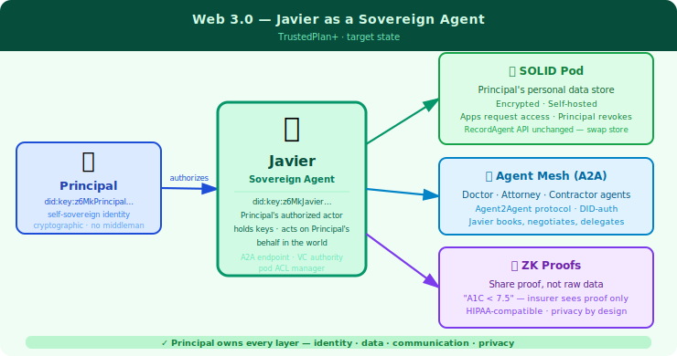

# Javier — My Life Assistant

*One Trusted Advisor for the Years That Matter Most*

**Author:** Frank Rojas  
**Date:** July 2026  
**Audience:** Investors · Prospective users · Collaborators

---

## The Problem No One Talks About

At 70, life is full. Too full.

A cardiologist who doesn't know the house is a financial drain. A financial planner who doesn't know health is declining. An estate attorney who doesn't know the emotional cost of leaving the home where the family grew up. Friends drifting away — slowly, invisibly — until one day you realize you can't remember the last real conversation with someone you used to know well.

Nobody is watching the whole picture. Nobody is connecting the dots.

**The cost compounds:**
- Missed connections → missed decisions → crises
- Each domain managed in isolation by the expert who only sees their slice
- The cognitive and logistical load does NOT decrease with age — it increases
- The one thing most likely to go unexamined: the quality of your closest relationships

This is the problem Javier solves.

---

## Meet Javier

**Javier** *(hah-vee-ay)* is a personal life assistant — one voice, one trusted advisor, backed by six expert agents who each know their domain deeply. One phone call. One app. One relationship.


Javier is not a chatbot. He is:
- **A chief of staff** — knows what every advisor is saying; synthesizes it into a clear picture
- **A wise counselor** — warm in delivery, unhurried in wisdom, calibrated for the 70s
- **A domain expert team** — six agents, each an authority in one life domain:

| Agent | What it knows |
|---|---|
| 🏠 **houseAgent** | Home systems, maintenance, financing, aging-in-place |
| 🏥 **medicalAgent** | Clinical history, medications, care navigation, health advocacy |
| 💰 **moneyAgent** | Personal wealth — accounts, retirement income, RMDs, runway |
| 📄 **estateAgent** | Assets, trust, succession, advance directives |
| 💚 **emotionalAgent** | Relationships, connection, grief, resilience — the domain most likely to go dark |
| ✝ **faithAgent** | Catholic practice, Ignatian Examen, community, meaning-making |

You don't have a different number for health questions and house questions. **You call Javier.**

---

## Javier in Action

### "Can I afford a new roof?"

> *"How are my finances — and can I afford to replace the roof?"*

What happens behind the scenes — in seconds:
- **moneyAgent** checks liquid savings, income, runway
- **houseAgent** pulls the roof assessment: cost, urgency, timeline
- **estateAgent** confirms no retirement plan impact

What Javier says back — in three sentences:

> *"Your liquid savings are $42K. The inspector flagged the roof as needed within two years and it runs $18–22K. You have the funds and the timing is good — want me to get contractor bids?"*

No spreadsheet. No calls. No coordinating three advisors who don't talk to each other.

---

### Health Crisis — All Hands

Frank is hospitalized unexpectedly. Before he even comes home:

1. **medicalAgent** logs the event, assesses care plan impact
2. **emotionalAgent** checks his relational support network — who does he need to call?
3. **moneyAgent** reviews insurance coverage and out-of-pocket exposure
4. **houseAgent** flags whether the house needs modifications for recovery
5. **estateAgent** checks whether the advance directive needs updating

Javier surfaces one unified message: *"Here's what this means, here's what to do, and here's who you should call."*

The relational dimension is not an afterthought. It's built in.

---

### The Invisible Risk — Connection Drift

The most consequential risk at 70 is not financial. It is relational.

Friendships thin through death and distance. Family bonds drift. Loneliness creeps in — slowly, invisibly — until it has become a health risk.

**emotionalAgent** is built for this:
- Tracks quality of human connection, not just mood state
- Flags when the cadence of meaningful relationships drops below threshold
- Detects when isolation and low faith community attendance correlate

When Javier sees the pattern — three weeks of below-threshold social contact — he raises it gently at the next check-in:

> *"It looks like the last few weeks have been a bit isolated. What would be a small step toward connection?"*

Not an alarm. A question. One concrete suggestion: a phone call, a coffee, a mass.

**No domain — including the quality of your closest relationships — goes dark.**

---

## Your Data. Your Control.

Javier runs on your data. That means the trust question matters.

The trust model in plain English:

- **Your data lives in YOUR Google Drive** — not our server. We don't have a copy.
- **Your secrets never leave your device** — credentials and passphrase live in a config file that is never uploaded, never committed to code.
- **Your identity is encrypted** — GPG-encrypted user store. Even with the config file, you can't be impersonated without the passphrase.
- **Your phone IS your login** — Twilio caller ID authenticates you. No password to type. No 2FA app to manage.

The security model is simple because the perimeter is simple:  
**one user · one device · one private Drive folder · one GPG key.**

---

## Javier Gets Smarter — Every Year

On day one, Javier knows his domain. By year two, he knows *you*.

Three layers of what an agent knows:

```
Layer 1 — Facts       (dates, costs, records, decisions)
Layer 2 — Your Story  (what happened, why you decided, what you were feeling)
Layer 3 — Patterns    (your habits, your risk tolerance, your blind spots)
```

All three grow over time. Every conversation logged. Every event stored. Every month reviewed.

By Year 2, ask **houseAgent** *"Tell me the story of my house since January"* and hear:

> *"The year started well — January inspection found no issues. Then March hit hard: you discovered the water heater was 17 years old and replaced it proactively for $1,400. Two months later the HVAC compressor failed on the hottest week of June. You almost patched it, but we ran the numbers and the heat pump made more sense at $12,800. You used the HELOC. The rest of the year was quiet. October: gutter guards installed. Smart call before winter."*

Not data retrieval. **Story. Humor. Pattern. Wisdom earned from your specific decisions over time.**

**Two speeds — one experience:**

| Speed | When | How |
|---|---|---|
| **Quick** (~1 second) | Routine questions | Haiku model + recent context |
| **Deep** (background) | Complex analysis | Opus/Sonnet + full records |

Deep analysis runs while you go about your day. Findings surface at your next check-in.

---

## Today vs. Tomorrow — The Ownership Gap

Today, Javier is an app inside other people's platforms.


Every layer has a middleman:
- **AI:** Anthropic processes every prompt — Anthropic sees your context
- **Data:** Google owns your Drive — can read it, go down, sell the company
- **Communication:** Gmail reads your email. Twilio owns your phone channel.

Principal is a **user** of these platforms. Javier is an **app** inside them.

---

Tomorrow, Javier is a sovereign agent. *Your* agent.



Every layer belongs to you:
- **AI:** Private LLM — your model, on your infrastructure. No one sees your queries.
- **Data:** Your SOLID pod — apps request access; you approve; data never leaves.
- **Communication:** Agent-to-agent protocols — Javier books your specialist directly. No receptionist. No fax. No phone call.
- **Identity:** You ARE your DID. No password file. No platform. Cryptographic proof.

Same Javier. Same six agents. Same interfaces.  
**One difference: you own it.**

---

### From Assistant to Advocate

> *Today:* Frank applies for long-term care insurance. Six-month underwriting. Forty-page medical questionnaire. Full EHR release to the insurer.

> *Web 3.0:* Javier generates a ZK proof bundle — *conditions controlled ✓ · no hospitalization in 3 years ✓ · medications within acceptable range ✓.* Insurer's agent verifies the proofs. Policy issued in 48 hours. **Insurer never sees a single lab value.**

The difference between an assistant and an advocate:  
**An advocate speaks for you without exposing you.**

---

## The Roadmap

Javier is built in phases — each one earning trust before adding capability.

| Phase | Name | What it means |
|---|---|---|
| 🌱 **BirthPlan** | Born | Voice + web. Six agents. Clean foundation. *(Year 1)* |
| ✅ **CertificationPlan** | Trusted | Javier narrates your year, reduces your burden, earns trust. *(Year 1–2)* |
| 📈 **Year2Plan** | Learning | Semantic search over records. Javier starts catching patterns. *(Year 2)* |
| 🔒 **TrustedPlan** | Sovereign identity | Your DID. Agent-to-agent protocols. *(Year 2–3)* |
| 🌐 **TrustedPlan+** | Sovereign agent | SOLID pod. Private LLM. Full data ownership. *(Year 3+)* |

**The smartest Web 3.0 prep is clean abstraction today.** Every layer built now — RecordAgent, the UANS naming system, UserContext — is a swap point later. Nothing changes for the user when Google Drive becomes a SOLID pod. Nothing changes for the agents when Anthropic becomes a private model. The architecture was designed for this evolution from day one.

---

## The Case in One Paragraph

Most people arrive at 70 managing health, finances, home, estate, relationships, and faith in silos — with no one watching the full picture. Javier changes that. One trusted advisor, backed by six expert agents, knowing what every advisor is saying and synthesizing it into clear action. The advisor that connects a house expense, a health event, and a faith check-in into a single insight. The system that notices when loneliness is creeping in — before it becomes a crisis. And eventually, as the technology matures, the advocate who holds your keys, owns your data, and speaks to the world on your behalf without a middleman. Not an app. **A sovereign agent for the years that matter most.**

---

*Technical architecture: `docs/lifeTrackerVision.md` · Web 3.0 evolution: `docs/strategy-Web3-MyAssistant.md` · Knowledge growth: `docs/strategy-KnowledgeAutonomousGrowth.md`*
